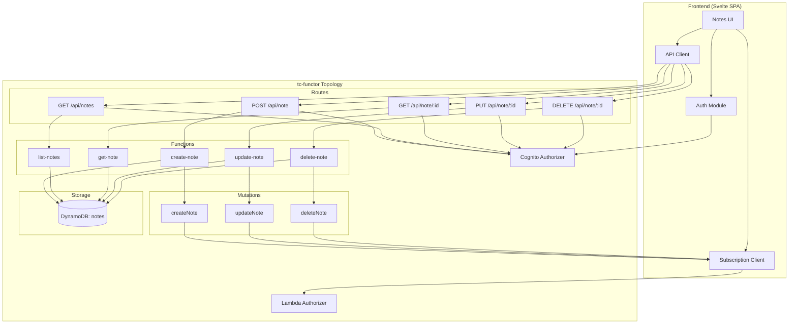

# Design Document

## Overview

The Notes App is a serverless web application built using tc-functors that enables authenticated users to manage personal notes. The system follows the tc-functor philosophy of composable, namespaced serverless entities mapped to AWS primitives.

The architecture consists of:
- **Frontend**: Svelte SPA with PicoCSS for responsive styling
- **API Layer**: REST routes for CRUD operations, GraphQL mutations for real-time subscriptions
- **Authentication**: Cognito user pool with OIDC integration
- **Storage**: DynamoDB table with user-scoped partitioning
- **Real-time**: AppSync GraphQL subscriptions via Lambda authorizer

## Architecture



## Components and Interfaces

### Topology Structure (topology.yml)

```yaml
name: notes

# Cognito authentication
authorizer: cognito

# REST API routes
routes:
  /api/note:
    method: POST
    function: create-note
    authorizer: cognito
    cors: true
    
  /api/notes:
    method: GET
    function: list-notes
    authorizer: cognito
    cors: true
    
  /api/note/{id}:
    method: GET
    function: get-note
    authorizer: cognito
    cors: true
    
  /api/note/{id}:
    method: PUT
    function: update-note
    authorizer: cognito
    cors: true
    
  /api/note/{id}:
    method: DELETE
    function: delete-note
    authorizer: cognito
    cors: true

# DynamoDB table
tables:
  notes:
    hash_key: userId
    range_key: noteId

# GraphQL mutations with subscriptions
mutations:
  authorizer: authorizer
  types:
    NoteInput:
      title: String!
      text: String
      tags: [String]
      priority: String
    Note:
      noteId: String!
      userId: String!
      title: String!
      text: String
      tags: [String]
      priority: String
      createdAt: String!
      updatedAt: String!
    DeletedNote:
      noteId: String!
      userId: String!
      
  resolvers:
    createNote:
      input: NoteInput
      output: Note
      function: create-note-mutation
      subscribe: true
    updateNote:
      input: Note
      output: Note
      function: update-note-mutation
      subscribe: true
    deleteNote:
      input: DeletedNote
      output: DeletedNote
      function: delete-note-mutation
      subscribe: true

# Frontend SPA
pages:
  app:
    dir: app
    dist: dist
    config_template: src/config.js
    skip_deploy: false
    build:
      - npm install --quiet --no-audit
      - npm run build
```

### Function Interfaces

#### create-note
- **Input**: `{ title: string, text?: string, tags?: string[], priority?: string }`
- **Output**: `Note` object with generated `noteId`, `userId` from auth context, timestamps
- **Side Effects**: Writes to DynamoDB, triggers `createNote` mutation for subscribers

#### list-notes
- **Input**: `{ tag?: string }` (optional filter)
- **Output**: `Note[]` sorted by `updatedAt` descending
- **Authorization**: Returns only notes where `userId` matches authenticated user

#### get-note
- **Input**: `{ id: string }`
- **Output**: `Note` or error
- **Authorization**: Returns 403 if `userId` does not match authenticated user

#### update-note
- **Input**: `{ id: string, title?: string, text?: string, tags?: string[], priority?: string }`
- **Output**: Updated `Note` object
- **Side Effects**: Updates DynamoDB, triggers `updateNote` mutation for subscribers
- **Authorization**: Returns 403 if `userId` does not match authenticated user

#### delete-note
- **Input**: `{ id: string }`
- **Output**: `{ noteId: string, userId: string }`
- **Side Effects**: Deletes from DynamoDB, triggers `deleteNote` mutation for subscribers
- **Authorization**: Returns 403 if `userId` does not match authenticated user

### Lambda Authorizer Interface

```python
def handler(event, context):
    token = event.get('authorizationToken')
    # Validate token against Cognito
    return {
        'isAuthorized': bool,
        'deniedFields': [],
        'ttlOverride': 3600,
        'resolverContext': {
            'userId': str  # Extracted from token
        }
    }
```

## Data Models

### Note Entity

| Field | Type | Description | Constraints |
|-------|------|-------------|-------------|
| userId | String | Partition key, user's Cognito sub | Required, from auth context |
| noteId | String | Sort key, unique note identifier | Required, UUID v4 |
| title | String | Note title | Required, 1-200 characters |
| text | String | Note body content | Optional, max 10000 characters |
| tags | List[String] | Categorization tags | Optional, max 10 tags, each max 50 chars |
| priority | String | Priority level | Enum: "low", "medium", "high", default "medium" |
| createdAt | String | ISO 8601 timestamp | Required, set on creation |
| updatedAt | String | ISO 8601 timestamp | Required, updated on every change |

### DynamoDB Table Design

- **Table Name**: `{topology-name}-notes`
- **Partition Key**: `userId` (String)
- **Sort Key**: `noteId` (String)
- **GSI**: `userId-updatedAt-index` for sorted listing

### GraphQL Types

```graphql
type Note {
  noteId: String!
  userId: String!
  title: String!
  text: String
  tags: [String]
  priority: String!
  createdAt: String!
  updatedAt: String!
}

input NoteInput {
  title: String!
  text: String
  tags: [String]
  priority: String
}

input NoteUpdateInput {
  noteId: String!
  title: String
  text: String
  tags: [String]
  priority: String
}

type DeletedNote {
  noteId: String!
  userId: String!
}

type Mutation {
  createNote(input: NoteInput!): Note
  updateNote(input: NoteUpdateInput!): Note
  deleteNote(noteId: String!): DeletedNote
}

type Subscription {
  onCreateNote(userId: String!): Note
  onUpdateNote(userId: String!): Note
  onDeleteNote(userId: String!): DeletedNote
}
```


## Correctness Properties

*A property is a characteristic or behavior that should hold true across all valid executions of a system-essentially, a formal statement about what the system should do. Properties serve as the bridge between human-readable specifications and machine-verifiable correctness guarantees.*

Based on the acceptance criteria analysis, the following correctness properties must be verified through property-based testing:

### Property 1: Protected routes reject unauthenticated requests
*For any* protected route (create, list, get, update, delete), a request without a valid authentication token SHALL receive a 401 Unauthorized response.
**Validates: Requirements 1.5**

### Property 2: Note creation populates all required fields
*For any* valid note input (non-empty title), the created note SHALL contain a unique noteId, the authenticated userId, createdAt timestamp, updatedAt timestamp, and priority defaulting to "medium" if not specified.
**Validates: Requirements 2.1, 8.2**

### Property 3: Empty title validation
*For any* note creation or update request with an empty or whitespace-only title, the operation SHALL be rejected with a validation error.
**Validates: Requirements 2.2**

### Property 4: Note persistence round-trip
*For any* successfully created note, querying the note by its ID SHALL return an equivalent note with all fields matching the original.
**Validates: Requirements 2.3, 4.1**

### Property 5: Notes list ordering
*For any* user with multiple notes, the list operation SHALL return notes sorted by updatedAt timestamp in descending order (newest first).
**Validates: Requirements 3.1**

### Property 6: Cross-user access denied
*For any* note owned by user A, requests from user B to get, update, or delete that note SHALL receive a 403 Forbidden response.
**Validates: Requirements 4.3, 5.3, 6.3**

### Property 7: Update preserves unmodified fields
*For any* note update that modifies a subset of fields, the unmodified fields SHALL retain their original values, and updatedAt SHALL be set to a timestamp newer than the previous value.
**Validates: Requirements 5.1**

### Property 8: Delete removes note
*For any* successfully deleted note, subsequent get requests for that noteId SHALL return a 404 Not Found error.
**Validates: Requirements 6.1**

### Property 9: Tag filter correctness
*For any* tag filter applied to the list operation, all returned notes SHALL contain the specified tag in their tags array.
**Validates: Requirements 7.2**

### Property 10: Subscription user isolation
*For any* subscription established by user A, note change events for notes owned by user B SHALL NOT be delivered to user A's subscription.
**Validates: Requirements 9.2**

### Property 11: Accessibility attributes present
*For any* interactive element (buttons, inputs, links) in the rendered UI, the element SHALL have appropriate ARIA labels or roles, and form error messages SHALL use aria-live regions.
**Validates: Requirements 11.1, 11.4**

## Error Handling

### HTTP Error Responses

| Status Code | Condition | Response Body |
|-------------|-----------|---------------|
| 400 Bad Request | Invalid input (empty title, invalid priority) | `{ "error": "validation_error", "message": "<details>" }` |
| 401 Unauthorized | Missing or invalid auth token | `{ "error": "unauthorized", "message": "Authentication required" }` |
| 403 Forbidden | Accessing another user's note | `{ "error": "forbidden", "message": "Access denied" }` |
| 404 Not Found | Note does not exist | `{ "error": "not_found", "message": "Note not found" }` |
| 500 Internal Server Error | Unexpected server error | `{ "error": "internal_error", "message": "An error occurred" }` |

### Validation Rules

- **title**: Required, 1-200 characters, trimmed whitespace
- **text**: Optional, max 10,000 characters
- **tags**: Optional array, max 10 items, each tag max 50 characters, alphanumeric and hyphens only
- **priority**: Optional, must be one of "low", "medium", "high"

### Error Logging

All errors are logged with:
- Request ID for tracing
- User ID (if authenticated)
- Error type and message
- Stack trace (for 500 errors only)

## Testing Strategy

### Property-Based Testing Framework

**Framework**: Hypothesis (Python) for backend function testing

Property-based tests will be configured to run a minimum of 100 iterations per property to ensure adequate coverage of the input space.

Each property-based test must be tagged with a comment in the format:
`# **Feature: notes-app, Property {number}: {property_text}**`

### Unit Tests

Unit tests cover specific examples and edge cases:

1. **Authentication Module**
   - Token parsing and validation
   - Session storage/retrieval
   - Sign-out cleanup

2. **Note Validation**
   - Title length boundaries (1, 200, 201 characters)
   - Text length boundary (10,000, 10,001 characters)
   - Tag count boundary (10, 11 tags)
   - Priority enum validation

3. **DynamoDB Operations**
   - Successful CRUD operations
   - Conditional check failures
   - Connection error handling

4. **API Response Formatting**
   - Correct status codes
   - Response body structure
   - CORS headers

### Integration Tests

Integration tests verify end-to-end flows:

1. **Authentication Flow**
   - Cognito redirect and callback
   - Token refresh
   - Sign-out

2. **CRUD Flow**
   - Create → List → Get → Update → Delete sequence
   - Verify data consistency across operations

3. **Subscription Flow**
   - Subscribe → Create note → Receive event
   - Verify user isolation

### Frontend Tests

1. **Component Tests** (Svelte Testing Library)
   - Note list rendering
   - Note form validation
   - Error message display

2. **Accessibility Tests** (axe-core)
   - ARIA attribute presence
   - Keyboard navigation
   - Focus management

### Test Data Generators

For property-based testing, custom generators will produce:

```python
# Note input generator
@composite
def note_inputs(draw):
    title = draw(text(min_size=1, max_size=200, alphabet=characters(whitelist_categories=('L', 'N', 'P', 'S'))))
    text_content = draw(text(max_size=10000) | none())
    tags = draw(lists(text(min_size=1, max_size=50, alphabet=characters(whitelist_categories=('L', 'N'))), max_size=10) | none())
    priority = draw(sampled_from(['low', 'medium', 'high']) | none())
    return {'title': title, 'text': text_content, 'tags': tags, 'priority': priority}

# User ID generator
@composite
def user_ids(draw):
    return draw(uuids().map(str))
```
