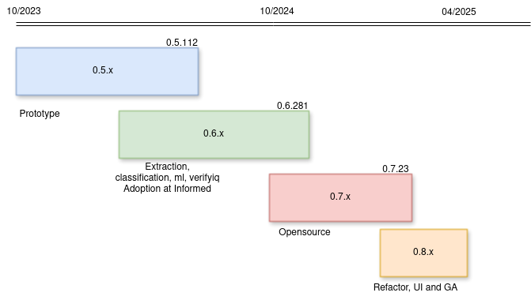

# tc

A graph-based, stateless, serverless application & infrastructure composer.

[](https://github.com/informed-labs/tc/actions/workflows/ci.yml)


`tc` defines, creates and manages the lifecycle of serveless entities such as functions, mutations, events, routes, states, queues and channels. tc compiles a tree of entities defined in the filesystem as a topology. This namespaced, sandboxed, versioned and isomorphic topology is called a `Cloud Functor`.

The word functor was popularized by Ocaml's parameterized modules. These modules, called functors, are first class. Cloud functors are similar in that they are treated as first class and are composable much like Ocaml's elegant modules.

## Key features of functors using tc

### 1. Composable Entities

At it's core, `tc` provides 7 entities (functions, events, mutations, queues, routes, states and channels) that are agnostic to any cloud provider. These entities are core primitives to define the topology of any serverless system. For example, consider the following topology definition:

```yaml

name: example

routes:
  myposts:
    path: /api/posts
    method: GET
    function: bar
    event: MyEvent

events:
  consumes:
    MyEvent:
      function: foo
      channel: room1

channels:
  room1:
    handler: default

functions:
  remote:
    foo: github.com/bar/bar
  local:
    bar: ./bar

```

Now, `/api/posts` route calls function `bar` and generates an event `MyEvent` which are handled by functions that are locally defined (subdirectories) or remote (git repos). In this example, the event finally triggers a channel notification with the event's payload. We just defined the flow without specifying anything about infrastructure, permissions or the provider. None of the infrastructure stuff has leaked into this definition that describes the high-level flow. This definition is good enough to render it in the cloud as services, as architecture diagrams and release manifests, almost magically.

`tc compile` maps these entities to the provider's serverless constructs. If the provider is AWS (default), tc maps `routes` to API Gateway, events to `Eventbridge`, `functions` to either `Lambda` or `ECS Fargate`, `channels` to `Appsync Events`, `mutations` to `Appsync Graphql` and `queues` to `SQS`

### 2. Namespacing

Now, if we run `tc compile` in the directory containing the above topology (topology.yml), we see that all the entities are namespaced. This implies there is room for several `foo`,`bar` or `MyEvent` entities in another topology. This also encourages developers to name the entities succinctly similar to function names in a module. With namespacing comes the benefit of having a single version of the namespace and thereby avoiding the need to manage the versions of sub-components.

### 3. Sandboxing

You can create a sandbox of this topology in the cloud (AWS is the default provider) using

```
tc create -s <sandbox-name> -e <aws-profile>
```

and can invoke (`tc invoke -s sandbox -e env -p payload.json`) this topology. This sandbox is also versioned and we can update specific entities or components in it. Sandboxing is fundamental to canary-based routing and deploys. `tc create` also knows how to build the functions, implicitly, for various language runtimes.

```
tc update -s sandbox -e env -c events|routes|mutations|functions|flow
```

### 4. Inferred Infrastructure

`tc compile` generates a lot of the infrastructure (permissions, default configurations etc) boilerplate needed for the configured provider. Think of infrastructure as _Types_ in a dynamic programming language.

### 5. Recursive Topology

Functors can be created at any level in the code repository's heirarchy. They are like fractals where we can zoom in or out. For example, consider the following retail order management topology:

```sh
order/
├── payment
│   ├── other-payment-processor
│   │   └── handler.py
│   ├── stripe
│   │   ├── handler
│   │   └── topology.yml
│   └── topology.yml
└── topology.yml
```

There are two sub-topologies in the root topology. `order`, `payment` and `stripe` are valid topologies. `tc` can create and manage sandboxes at any level preserving the integrity of the overall graph.

```
cd order
tc create -s <sandbox> -e <env> --recursive
```

This feature helps evolve the system and test individual nodes in isolation.

### 6. Isomorphic Topology

The output of `tc compile` is a self-contained, templated topology (or manifest) that can be rendered in any sandbox. The template variables are specific to the provider, sandbox and configuration. When we create (`tc create`) the sandbox with this templated topology, it implicitly resolves it by querying the provider. We can write custom resolvers to resolve these template variables by querying the configured provider (AWS, GCP etc).

```
tc compile | tc resolve -s sandbox -e env | tc create
```

We can replace the resolver with `sed` or a template renderer with values from ENV variables, SSM parameter store, Vault etc. For example:

```
tc compile | sed -i 's/{{API_GATEWAY}}/my-gateway/g' |tc create
```

The resolver can also be written in any language that is easy to use and query the provider, efficiently.

The output of the compiler, the resolver and the sandbox's metadata as seen above are _isomorphic_. They are structurally the same and can be diffed like git-diff. Diffable infrastructure without having external state is a simple yet powerful feature.


## Resources

Documentation: [https://informed-labs.github.io/tc/](https://informed-labs.github.io/tc/)

Video Presentation on tc from AWS Community Day - Bay Area Sept 2024
[Higher Order Abstraction & Tooling for Step Functions & Serverless](https://youtu.be/1gqDGulszzQ?si=dtHcUkQF2nhZ_td8)

## Basic Usage


```sh
Usage: tc <COMMAND>

Commands:
  bootstrap  Bootstrap IAM roles, extensions etc
  build      Build layers, extensions and pack function code
  cache      List or clear resolver cache
  compile    Compile a Topology
  config     Show config
  create     Create a sandboxed topology
  delete     Delete a sandboxed topology
  freeze     Freeze a sandbox and make it immutable
  emulate    Emulate Runtime environments
  inspect    Inspect via browser
  invoke     Invoke a topology synchronously or asynchronously
  list       List created entities
  publish    Publish layers
  resolve    Resolve a topology from functions, events, states description
  route      Route events to functors
  scaffold   Scaffold roles and infra vars
  test       Run unit tests for functions in the topology dir
  tag        Create semver tags scoped by a topology
  unfreeze   Unfreeze a sandbox and make it mutable
  update     Update components
  upgrade    upgrade tc version
  version    display current tc version
  doc        Generate documentation
  help       Print this message or the help of the given subcommand(s)

Options:
  -h, --help  Print help
```
## History and Roadmap

We've been working on tc for quite a while in a private repo, but much of that time was focused on the internal needs of Informed. Since the creation of this public repo we have started work on making it suitable for broader use cases beyond our own.

Here is a snapshot of the history and future plans. Please let us know how we could make it useful for your use cases as well.



## Contributing

Though significant work has been done previous to this public repo for internal use at Informed, this project is still quite nascent and is being actively developed to be suitable for use outside of Informed.

We welcome contributions from the community! Whether you're just giving feedback, fixing bugs, improving documentation, or proposing new features, your efforts are appreciated.

### Code of Conduct

This project follows the Contributor Covenant Code of Conduct. We expect all contributors to adhere to its guidelines to maintain a welcoming and inclusive environment. Please read our [Code of Conduct](code_of_conduct.md) before participating.

### Getting Started

1. Try out tc by following the [installation guide](https://informed-labs.github.io/tc/installation.html)
2. Build from source:
   - Follow the [build instructions](https://informed-labs.github.io/tc/installation.html#building-your-own) to compile tc locally
   - This is a great way to understand the codebase and start contributing

### Ways to Contribute

- **Report Issues**: Found a bug or have a suggestion? Open an issue on our [tc GitHub Issues](https://github.com/informed-labs/tc/issues) page
- **Submit Pull Requests**: Have a fix or enhancement? PRs are welcome! [tc Github PRs](https://github.com/informed-labs/tc/pulls)
- **Improve Documentation**: Help make our docs better by fixing errors or adding examples
- **Join Discussions**: Participate in [GitHub Discussions](https://github.com/orgs/informed-labs/discussions) to share ideas, ask questions, and help others

### Development Process

1. Fork the repository
2. Create a feature branch
3. Make your changes
4. Write or update tests as needed
5. Submit a pull request
6. Respond to any feedback

We aim to review all contributions promptly and look forward to collaborating with you!
